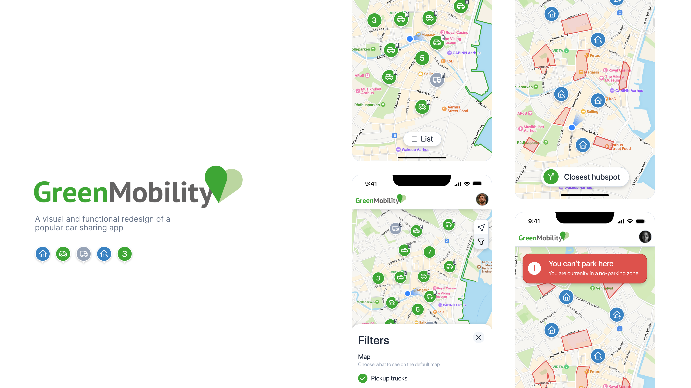
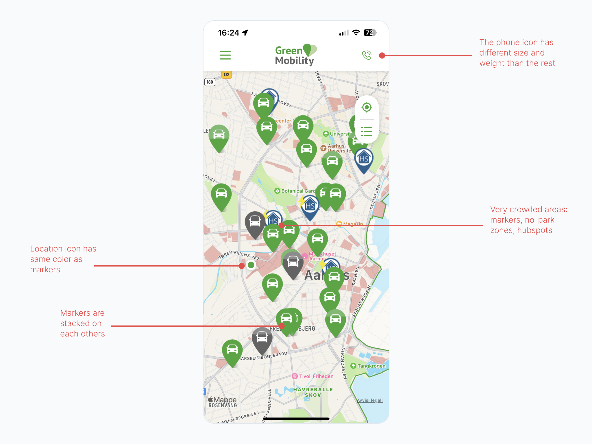

import Gallery from "../../components/Gallery.tsx";
import GreenMobilityMap from "../../images/green-mobility-map.png";
import GreenMobilityList from "../../images/green-mobility-list.png";
import GreenMobilitySettings from "../../images/green-mobility-settings.png";
import GreenMobilityMapRedesign from "../../images/gm-redesign-map.png";
import GreenMobilityFilterRedesign from "../../images/gm-redesign-filters.png";
import GreenMobilityDrivingMode from "../../images/gm-redesign-dm.png";
import GreenMobilityDrivingModePark from "../../images/gm-redesign-dm-park.png";
import GreenMobilityDrivingModeHubspot from "../../images/gm-redesign-dm-hubspot.png";

Green Mobility is a car sharing service offered in Northern Europe. I identified key pains and flaws the current design has and designed a personal solution to those problems. This is an exercise in visual and functional design I took on to improve my skills.

## Introduction

Green Mobility is a mobile platform that allows users to easily find electric cars in the cities in which it operates, with ease and at an affordable price. If you never heard of it before, then it's because it's currently available in only a few cities of northern Europe (Copenhagen, Amsterdam, Helsinki, to name a few).

I personally have used Green Mobility in many occasions, for getting across my city, or for a weekend escape. The app per se works very well and I have never had big problems while using it. However, in terms of both functionality and visual design, I believe it currently falls short of its full potential. The UI feels old and clunky, many interactions with the map are buggy and the screen just feels crowded to the eyes.

I believe that if these improvements will be addressed, they could already bring important benefits to the everyday users.

Since I don't have a formal design background, this is a project I took on as an exercise to develop and further improve my UI/UX skills. The following redesign is purely based on design theory, current trends and personal research.

## Identifying the pains

Firstly, I've decided to divide the app into 3 main areas of the UI that can be tackled separately:

1. The map is too cluttered and hard to read, there are too many elements on the screen that serves different purposes and are not
   essentials to be viewed all at once by the user

2. The list of cars is not very readable and it's hard to find the car you're looking for. This is also true for the car details screen (the screen that appears when you tap on a car).

3. The settings screen is very cluttered and hard to read. It's also not very intuitive to navigate.

The following are screenshots of the current app, with the areas I've identified highlighted.

<Gallery
  images={[
    GreenMobilityMap.src,
    GreenMobilityList.src,
    GreenMobilitySettings.src,
  ]}
  captions={["Map screen", "Listed cars", "Settings"]}
/>

To prevent myself from doing a complete app redesign, I've decided to only focus on the map, since it's the most important screen of the app and the one that needs the most improvements. These are the main issues I come across while using the map:

To clarify some elements on the screen that might not seem too clear:

- The gray markers are pickup trucks, usually used for moving houses or transporting big objects.
- The blue markers with the home icon are called _Hubsposts_ and are places where you can park the car for free. If a lighting icon is present, it means that the hubspot has a charging station.
- The highlighted red areas are _no-parking zones_ and it's forbidden to park the car there. The app will not allow you to end your trip if you're parked in one of these areas.
- The _list_ icon (top right under the location icon) will show the list of cars in the area, by proximity to the user's current location.

### Too many markers

The main issue here is that the map is too cluttered with markers and it's hard to read. The user has to spend too much time looking for the car he wants to rent, and the map is not very intuitive to navigate. Whenever I explore the screen, it's very difficult to know how many cars are in one place, and how many are in another. It is also quite hard to read when zoomed out, since the markers are too small and the map gets too cluttered.

### Crowded map

On top of the markers, the app also displays hubspots and no-parking zones, which are only useful when looking for parking after a trip has started already. These elements are not essential to the user when looking for a car, and they only add to the clutter of the map.

### Additional improvements

There are also some improvements that can be added to the screen. For example, I usually find myself going through every car marker around me to check how much battery they have left. This information could be displayed directly on the map, so that the user can easily see which cars are available and which are not.

## The redesign

### Layout and markers

<Gallery
  images={[GreenMobilityMapRedesign.src, GreenMobilityFilterRedesign.src]}
  captions={["Declustered map", "Map filters"]}
/>

I didn't want to drastically change the navbar, since that would have required more research which would have been out of the scope of redesigning the map. Still, I've decided to hide the phone and the menu icon, adding a user avatar instead. This way the settings are all hidden under one icon, and the user can easily access them. Given the importance of the phone icon (which allows a quick and direct access to the customer support) it could be showed as the first element of the menu, highlighted.

The logo has been kept (made horizontal and slightly smaller) because it's a very recognizable element of the brand, and I assume it would be very difficult to get rid of on a real redesign.

The map has been decluttered by removing the hubspots and the no-parking zones. They will appear during the "Driving mode", which I'll showcase in the next section, but they can still be made visible by clicking on the "Filter" icon. The markers have been made circular and more precise, with a change in the iconography to make it look modern and clean.

The car battery has been added to the marker itself, so that the user can easily see which cars have more battery left.

More importantly, the markers now group together when zoomed out, and they show the number of cars in that area. This way the user can easily see how many cars are in one place, and how many are in another. This is a very common pattern in map apps, and it's very intuitive to use.

Moreover, the "List" icon has been made as a button at the bottom with a clear text suggesting the switch of the view (a similar pattern is used by AirBnB to switch between list and map listings), and lastly the current location has been made blue to make it more visible and recognizable like in popular map apps (Google, Apple).

#### Filtering

I've added a filtering button to the app, because even if the no-parking zones and hubsposts are not essential to the user when looking for a car, tehy should still be able to look for it, for example if they need to figure it out in advance where a specific hubspot is located or if they can park next to their friend's house. The filter button will also allow the user to filter the cars by battery percentage, so that only the cars with a certain amount of battery will be shown.

### Driving mode

<Gallery
  images={[
    GreenMobilityDrivingMode.src,
    GreenMobilityDrivingModeHubspot.src,
    GreenMobilityDrivingModePark.src,
  ]}
  captions={[
    "Driving mode",
    "Go to nearest hubspot",
    "Alert message when on no-parking zone",
  ]}
/>
